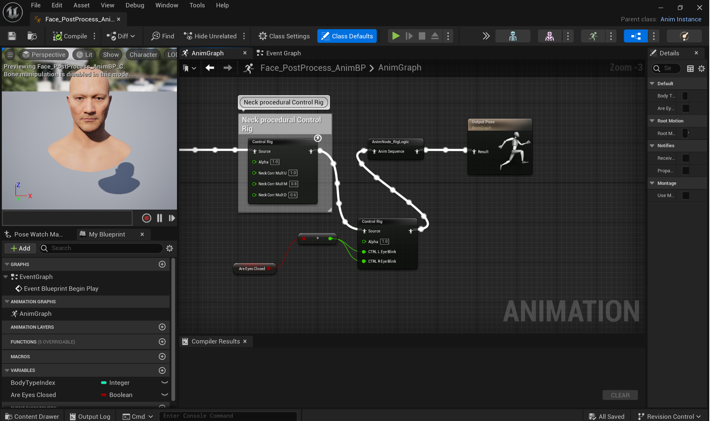

## BLINKING FEATURE FOR METAHUMAN CHARACTERS  👀 ##
   
- Blinking significantly improves the realism of Metahumans. With the implementation of blinking, virtual characters appear more human-like. 🙈
   
Example video of the random eye blinking in the current project in Unreal Engine 5:
   
      
        
          
        
 📝 **Steps:** 
   
1. Find the Face Post-Process Animation Blueprint under the "Contents" folder in the Unreal Engine Editor.
   
2. Open the Animation Graph.
   
3. Place a "Control rig" in the graph  after the "Neck procedural Control Rig".
   
4. In the Details tab, for the "Control Rig Class" select "Face_ControlBoard_CtrlRig".
   
5. In the control rig node's input section, enable "Control Left Eye Blink" and "Control Right Eye Blink".
   
6. Add a Boolean variable named "Are Eyes Closed" under the Variables section of the BP.
   
7. Add the "Are Eyes Closed" variable to the Animation Graph and connect it to the CTRL L Eye Blink and CTRL R Eye Blink inputs.
   
8. Open the Event Graph.
   
9. To make the Metahuman blink perodically, add the "Event Blueprint Begin Play" node to the Event Graph.
   
10. Add two instances of the "Are Eyes Closed" variable to the graph. Set "Are Eyes CLosed" true for one and falsefor the other one to alternate eye opening and closing. 
   
11. Add "Delay" node to the graph. Connect it to the "Random Float in Range" Node. 
   
12. Set a delay of minimum 0.1 to maximum 0.15 seconds before opening the eyes. 
  
13. For the eyes closed node, set a delay of minimum 2 to maximum 4 seconds before closing the eyes.
   
14. Create a loop between them to make the blinking repeat indefinitely. 🔄✨

   
**BLUEPRINTS OF THE BLINKING FEATURE IN THE CURRENT UE PROJECT**
   
**Animation Graph** 🏃
   
 
   
**Event Graph** 🏃
   
 
   

   
_References_
   
Here is the link of the video I used for blinking feature: https://www.youtube.com/watch?v=9yCHD1Mq_8U
   
